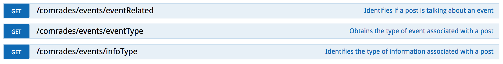

# ")
Website: https://evhart.github.io/crees/

The [COMRADES](http://www.comrades-project.eu/) CREES Services (Crisis Event Extraction Service) provide a rest API for annotating short text documents (e.g. tweets) by 1) identifying if a document is related to a crisis; 2) the type of event discussed, and; 3) the type of information present in a document.

The CRESS API is a multilclass CNN classifier that is trained on the [CrisisLexT26 data](https://github.com/sajao/CrisisLex/tree/master/data/CrisisLexT26). The model extends  Kim Yoon’s [Convolutional Neural Networks for Sentence Classification](http://arxiv.org/abs/1408.5882) and Denny Britz's [work](https://github.com/dennybritz/cnn-text-classification-tf). The model was published along the Dual-CNN model in the paper: [On Semantics and Deep Learning for Event Detection in Crisis Situations](http://oro.open.ac.uk/49639/).


If you use this code/model please cite the following publication:

- *[On Semantics and Deep Learning for Event Detection in Crisis Situations](http://oro.open.ac.uk/49639/)*
Burel, Grégoire; Saif, Hassan; Fernandez, Miriam and Alani, Harith (2017). On Semantics and Deep Learning for Event Detection in Crisis Situations. In: Workshop on Semantic Deep Learning (SemDeep), at ESWC 2017, 29 May 2017, Portoroz, Slovenia.

## APIs Usage


The CREES API exposes 3 services that can be tested using a web browser. By defualt, they are accessible under */comrades*. Each method can be accessed using a *GET* query with the *text* parameter or a *POST* query that can be used for annotating more than one document. The methods are the following:

1) ***/comrades/events/eventRelated***: Determines if a document is related to a crisis sitution. The following labels are returned: *"non-related", "related"*.

2) ***/comrades/events/eventType***: Determines the type of crisis discussed in a document. The following labels are returned: *"bombings", "collapse", "crash", "derailment", "earthquake", "explosion", "fire", "floods", "haze", "meteorite", "none", "shootings", "typhoon"* and *"wildfire"*.

3) ***/comrades/events/infoType***: Determines the type of information discussed in a document. The following labels are returned: *"affected_individuals", "caution_and_advice", "donations_and_volunteering", "infrastructure_and_utilities", "not_applicable", "not_labeled", "other_useful_information"* and *"sympathy_and_support"*.

Each method returns a similar JSON object. For example:
```sh
curl -G http://127.0.0.1/comrades/events/infoType  \
--data-urlencode 'text=If you are evacuating please dont wait, take your pets when you evacuate #HighParkFire'
```
```json
{
    "classifier": "CNN",
    "input": "if you are evacuating please dont wait, take your pets when you evacuate ",
    "label": "caution_and_advice",
    "version": 0.3
}
```

Although the *GET* method only accept one document as input, you can use their *POST* version in order to annotate more than one document by submitting a JSON array containning a list of documents to annotate. Each method returns a similar JSON object. For example:

```sh
 curl -X POST http://127.0.0.1/comrades/events/eventRelated  --header 'Content-Type: application/json' -d '["If you are evacuating please dont wait, take your pets when you evacuate #HighParkFire", "AAPL, NBA playoffs 2013, New York Post, West Texas, ..."]'
```
```json
{  
   "labels": [  
      {  
         "input": "If you are evacuating please dont wait, take your pets when you evacuate #HighParkFire",
         "label": "related"
      },
      {  
         "input": "AAPL, NBA playoffs 2013, New York Post, West Texas, ...",
         "label": "non-related"
      }
   ],
   "classifier": "CNN",
   "version": 0.3
}
```

## Installation and Usage
The CREES services can be run inside or outside a [docker](https://docker.com/) container. By default the API will be accessible on port 80 with the documentation accessible on *'/comrades'* and the services exposed under *'/comrades/events'*.

### Requirements
The CREES services need the following libraries installed and Python 2:
* python 2 (tested on 2.7.10)
* tensorflow==0.12.1 [tensorflow (0.12.1)](https://www.tensorflow.org/versions/r0.12/get_started/os_setup)
* numpy
* flask
* flask-restplus
* enum34


### Starting the Server
For starting the CREES server you can simply run the *crees_server.py* file:

```sh
python crees_server.py --help
```

```
Usage: crees_server.py [options]

Options:
  -h, --help            show this help message and exit
  -p PORT, --port=PORT  the API port for serving CREES [default: 80]
  -n API_NAMESPACE, --namespace=API_NAMESPACE
                        the API namespace for CREES [default: comrades]
```


You can also pass the arguments using environment variables:
```
CREES_PORT=8080 CREES_NAMESPACE='crees' python crees_server.py
```

### Docker Usage
You can also run CREES using [docker](https://docker.com/) . First, you need to build the docker image.
```sh
docker build -t evhart/comrades_crees:latest .
```

The CREES service will be automatically started when you start a CREES container. You can run the container interactively (-i):
```sh
docker run -i -p 80:80 --name crees_server evhart/comrades_crees:latest
```
Or as a daemon (-d):
```sh
docker run -d -p 80:80 --name crees_server evhart/comrades_crees:latest
```

You can also pass environment variables to the docker container for modifying the default namespace and port:
```
docker run -i -p 80:8080 --name crees_server  \
-e CREES_PORT=8080 \
-e CREES_NAMESPACE=crees \
evhart/comrades_crees:latest
```


## References
- *[On Semantics and Deep Learning for Event Detection in Crisis Situations](http://oro.open.ac.uk/49639/)*
Burel, Grégoire; Saif, Hassan; Fernandez, Miriam and Alani, Harith (2017). On Semantics and Deep Learning for Event Detection in Crisis Situations. In: Workshop on Semantic Deep Learning (SemDeep), at ESWC 2017, 29 May 2017, Portoroz, Slovenia.
- [COMRADES H2020 European Project](http://www.comrades-project.eu/)
- [CrisLex Datasets](http://crisislex.org/data-collections.html)
- [Convolutional Neural Networks for Sentence Classification](http://arxiv.org/abs/1408.5882)
- [Implementing a CNN for Text Classification in TensorFlow](http://www.wildml.com/2015/12/implementing-a-cnn-for-text-classification-in-tensorflow/)

## Acknowledgment
This work has received support from the European Union’s Horizon 2020 research and innovation programme under grant agreement [No 687847](http://cordis.europa.eu/project/rcn/198819_en.html) ([COMRADES](http://www.comrades-project.eu/)).
